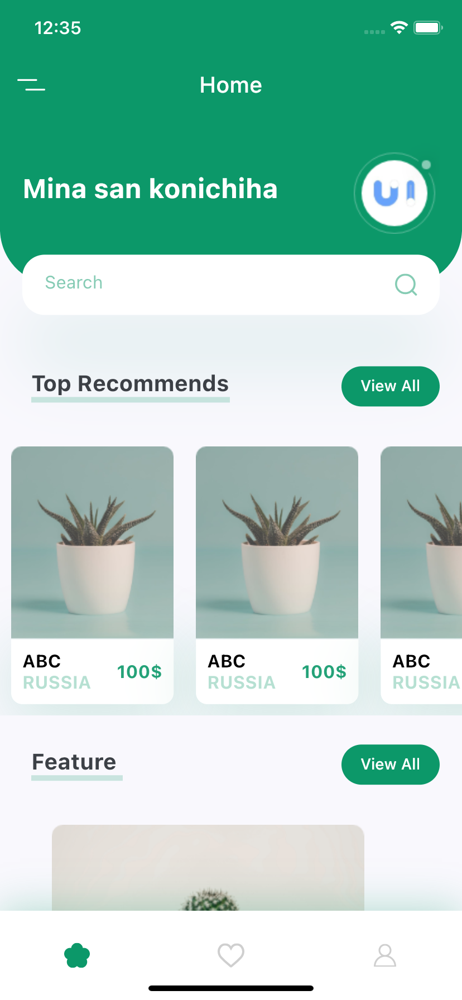
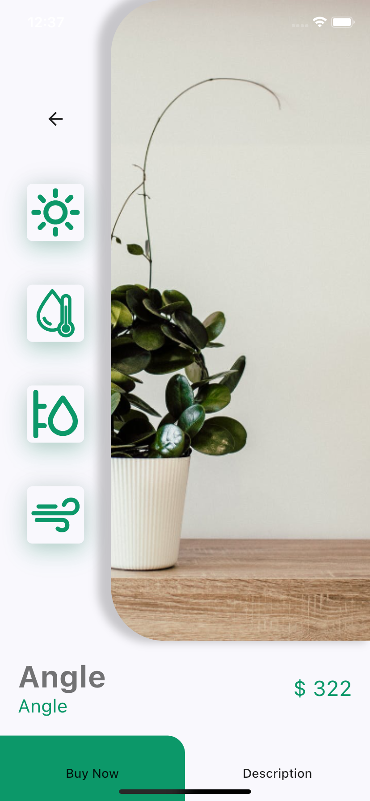

# Purpose

I made 2 screens. Because of my goal is familiar with some flutter widget, so i just focus UI.

#### Note

Because some deprecated library, we need run app with flag "--no-sound-null-safety"

```bash
 flutter run --no-sound-null-safety
```

or add local config for vscode. Make `.vscode/setting.json`

```json
{
  "dart.flutterAdditionalArgs": ["--no-sound-null-safety"]
}
```

#### vscode error

We cant find device even run flutter doctor have no problem. because we setting ` --no-sound-null-safety`

# Result

  <div style="display:flex">
  
  <div>　　　</div>
  
  </div>
